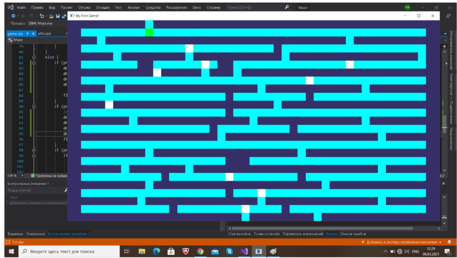
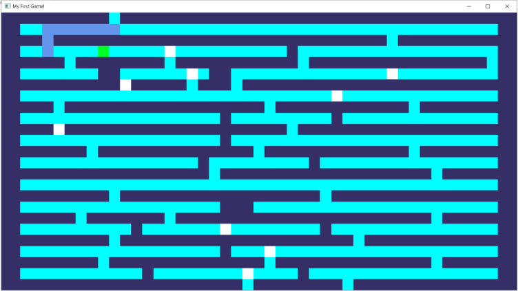
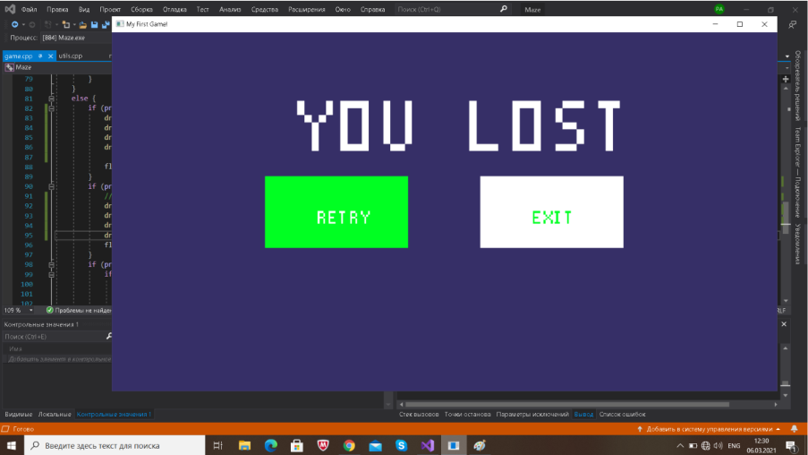
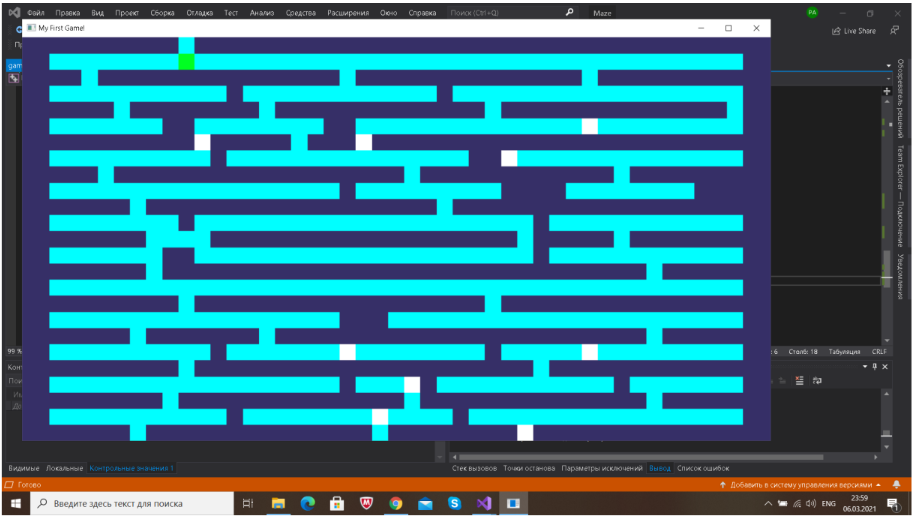
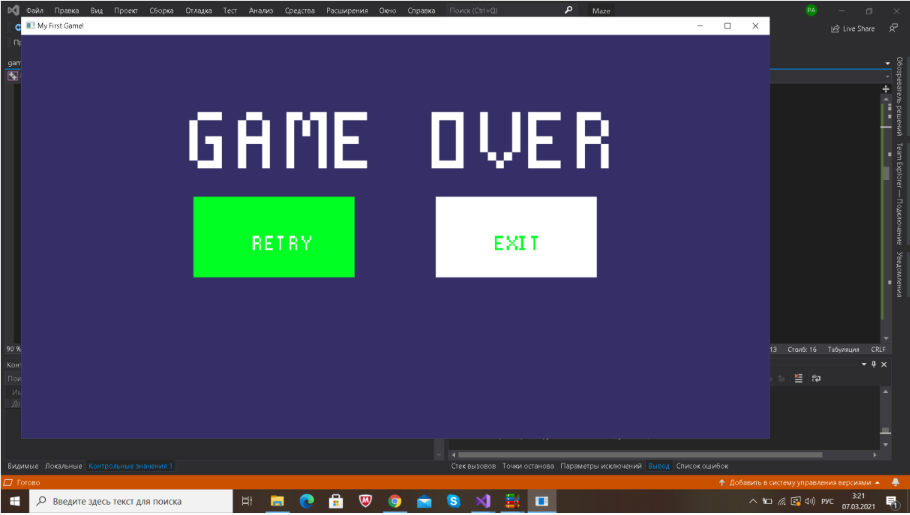

# TASK
The player needs to get out of the maze consisting of several (at least 2) levels. Mandatory elements of the task are:  
Reading the maze map from a text file.  
one of several options:  
Basic set:  
empty space: ‘ ‘ (space)  
wall: ‘#’  
floor: ‘.’  
player: ‘@’  
exit from level: ‘x’  
floor, which can be traversed a limited number of times (after which it is destroyed): ‘,’  
Visualization of the map using graphics with mandatory display of all game elements with different images (tiles / sprites).  
Implementation of movement and interaction with the player's environment using keyboard controls (for example, W, A, S, D, space). The player must not pass through walls.  
When falling into a void / trap, the player must die: with the help of graphics, it is necessary to display a message about the loss and end the game.  
If the player has reached the exit from the level, it is necessary to use graphics to display a message about the transition to the next level, or about the successful end of the game, if it was the last level.  
# OUTPUT
Controlled Player - Green  
Emptiness - white  
wall - purple  
ruined floor - lilac  
  
Restriction: You can walk on the floor 3 times. After that, the floor collapses and  
turns purple.  
  
After hitting the void or finding an exit, a menu appears informing that  
the player has lost or won.The menu allows the player to start the game again, exit the game  
and go to a new level.  
  
  
The maze of the second round  
  
After completing all levels, it is reported that the game is over  
  
